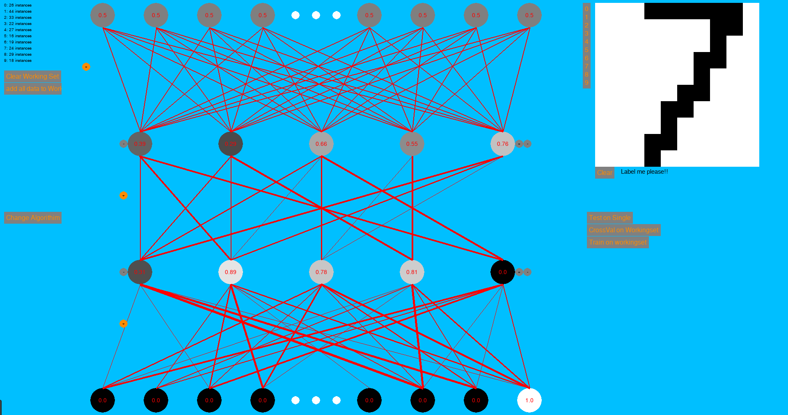
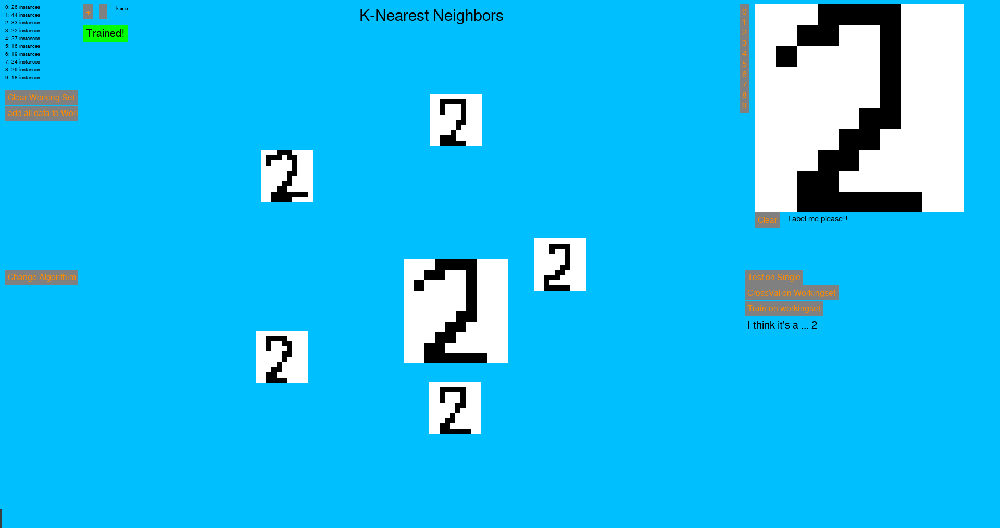

# Machine Learning Playground
(**This was a final project for 10-401 Intro to Machine Learning**)

An interactive envrionment to learn about different machine learning algorithms by playing with them. The supported algorithms are K-Nearest Neighbors, and a simple feed forwarad neural network.
(Note: The neural net currently doesn't work and I didn't have enough time to figure out if there was a bug in the implementation, or if this specific classification problem and NN architecture were a bad match. C'est la vie)

## The Big Idea
The task at hand is classifying digits drawn in a 10x10 pixel grid. 

The big idea is creating an environment where the user is able to make new digits on the fly and see how the algorithm classifies them. This is really helpful for understanding how the algorithm is trying to classify digits. It also helps build intuition about when a given algo will or won't be able to do a good job classifying. How does it do on digits that are genuinly ambiguous? What happens if draw your 1's differently? How much training data do you need it starts doing a good job?

## Install
* Clone this repo with `git clone https://github.com/Bureau-of-Unspecified-Operations/ML-PlayGround.git`
* Install pygame with `pip install pygame`
* Install numpy with `pip install numpy`
* Navigate to the into the repo and run `python Main.py`
